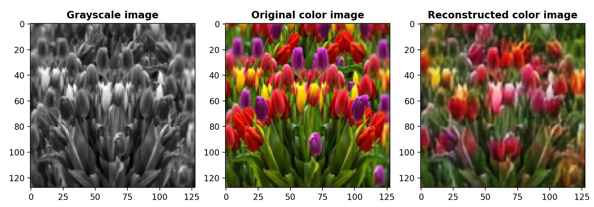

# Image Colorization using Deep Autoencoder in PyTorch

This project implements an image colorization model using a deep autoencoder architecture in PyTorch. The model takes grayscale images as input and generates their corresponding RGB colorized versions. The deep autoencoder learns to capture image features and reconstruct colored images by leveraging convolutional layers for efficient encoding and decoding.

## Trained Model Results

Here are some results generated by the model trained by me, available in the **Trained Model** folder:





and many more available in the **Results** folder.

## Model Training and Prediction

This repository contains two training scripts, `train_cpu.py` and `train_gpu.py`, that allow you to train the model either on the CPU or GPU. Both scripts accept the same set of command-line arguments to control the training process. Additionally, there is a script `predict.py` that takes a test image and generates predictions based on the trained model.

## Training Scripts

### `train_cpu.py` and `train_gpu.py`

These two scripts are used to train the model on either the CPU or GPU, respectively. The difference between the two is that `train_cpu.py` runs the training on the CPU, while `train_gpu.py` uses the GPU for faster training (if available).

#### Arguments:
Both scripts accept the following arguments:

- `--data`: Specifies the training data directory that contains the training images.
- `--batch_size`: The batch size used during training.
- `--epochs`: The number of training epochs.
- `--lr`: The learning rate for optimization.
- `--weight_decay`: Weight decay for regularization.

#### Example Usage:
To train the model on the CPU:
```bash
python train_cpu.py --data /path/to/training/data --batch_size 32 --epochs 20 --lr 0.001 --weight_decay 1e-5
```

To train the model on the GPU (if available):
```bash
python train_gpu.py --data /path/to/training/data --batch_size 32 --epochs 20 --lr 0.001 --weight_decay 1e-5
```

Both scripts will save the best model weights during training to a file named `best_model.pt`. This file contains the model with the highest performance on the validation set.

## Prediction Script

### `predict.py`

This script is used to make predictions on new images using the trained model.

#### Arguments:
- `--image`: The path to the test image for which the model should generate predictions.

#### Example Usage:
To generate predictions for a test image:
```bash
python predict.py --image /path/to/test/image.png
```

The script will load the `best_model.pt` file and use it to predict the result for the provided test image.

## Conclusion

- `train_cpu.py` and `train_gpu.py` are used for training the model.
- `predict.py` is used to generate predictions on test images.
- After training, the best model weights are saved in `best_model.pt`.

Feel free to modify the arguments and scripts as needed for your specific use case!
